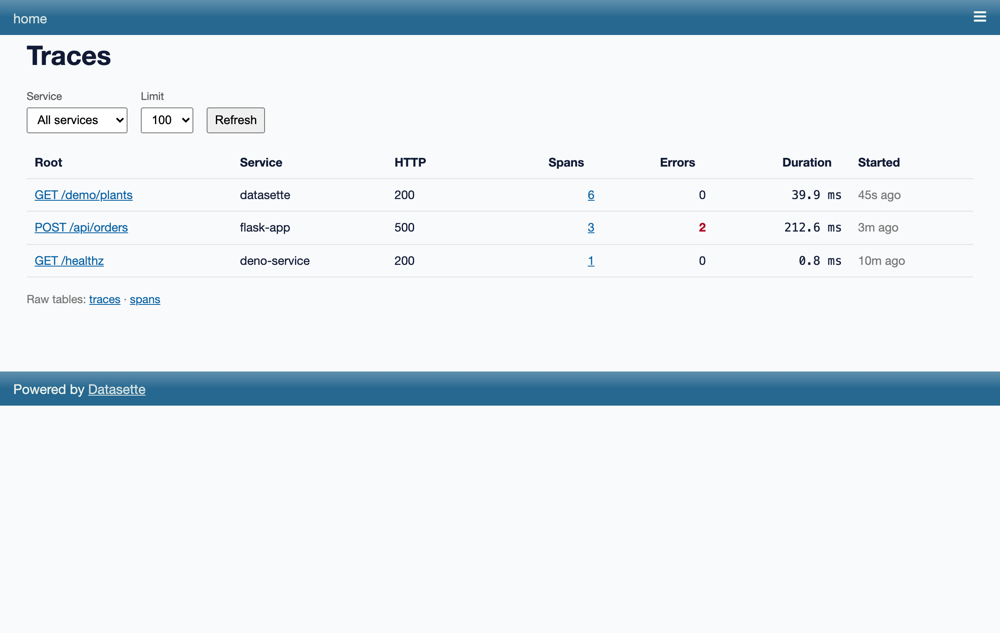
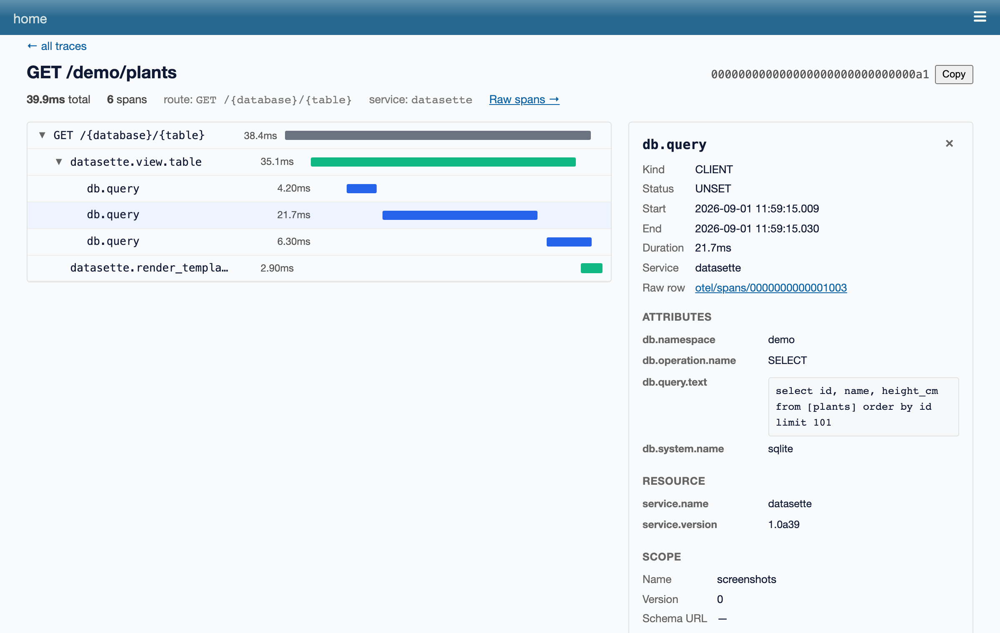

# datasette-otel-receiver

Store, receive and browse OpenTelemetry traces in Datasette. One plugin, three
roles, one SQLite database:

- **Self-tracing** (on by default): every span this Datasette emits is stored in a
  `traces`/`spans` database served by the same instance.
- **OTLP receiver** (opt-in): a `POST /v1/traces` OTLP/HTTP endpoint (protobuf and
  JSON, gzip, bearer auth) — point any OTel source at it: another Datasette
  running [datasette-otel-otlp], a Flask app under `opentelemetry-instrument`, a
  Deno service, a browser SDK.
- **Viewer**: `/-/traces` lists recent traces (any service), each linking to a
  waterfall at `/-/traces/<trace_id>`. The raw tables are regular Datasette
  tables — facets, JSON API and SQL come free.

Successor to `datasette-otel-debugger`. Works against Datasette's OpenTelemetry
branches (phase 1); no released Datasette emits these spans yet.

## Privacy — read this first

**The span store contains `db.query.text`: on a public instance that is
user-supplied SQL, with literals.** It also holds URL paths and other request
attributes. Because of that the store and viewer are **private by default**:
reading them requires the `otel-view` permission (grant it via standard
Datasette permissions config, or use `--root`). `public_viewer: true` opens the
`/-/traces` pages only — the raw tables stay gated. SQL parameter *values* are
never recorded by Datasette core, only parameter counts.

## Quickstart (self mode)

```bash
datasette install datasette-otel-receiver
datasette mydata.db --root
# browse a few pages, then open /-/traces
```

No config needed: spans are stored in `otel.db` next to where you ran Datasette,
with a 72-hour / 100,000-span ring buffer.

## Receiving spans from other services

```yaml
plugins:
  datasette-otel-receiver:
    ingest_token: $OTEL_INGEST_TOKEN   # enables POST /v1/traces
```

Senders use standard OTLP/HTTP env vars — base endpoint, the exporters append
`/v1/traces` themselves:

```sh
OTEL_EXPORTER_OTLP_ENDPOINT=https://your-datasette.example.com \
OTEL_EXPORTER_OTLP_PROTOCOL=http/protobuf \
OTEL_EXPORTER_OTLP_HEADERS="authorization=Bearer $OTEL_INGEST_TOKEN" \
opentelemetry-instrument python your_app.py
```

`/v1/metrics` and `/v1/logs` are accept-and-discard stubs (so instrumented
senders don't log 404 warnings); traces only in v1.

## Config reference

```yaml
plugins:
  datasette-otel-receiver:
    self_traces: true          # false: viewer/receiver only
    ingest_token: $TOKEN       # setting this enables the OTLP endpoint
    # allow_unauthenticated_ingest: true   # dev-only escape hatch
    public_viewer: false       # true: /-/traces without a permission grant
    retention_hours: 72        # ring buffer: whole traces older than this go
    max_spans: 100000          # ...and oldest whole traces beyond this count
    db_name: otel
    db_path: otel.db
    service_name: datasette    # service.name for self-emitted spans
```

## How self-tracing avoids tracing itself

Storing a span means SQL writes through Datasette's instrumented write path —
which emits three more spans, which would be stored, which… (measured: ~10–14k
spans/s runaway, or deadlock, depending on configuration). This plugin ships the
one workaround that held up under measurement: it installs its own
`TracerProvider` whose sampler drops any span started under a private context
key, and attaches that key around every store write. Details and the failed
alternatives: `demos/otel/self_storage/README.md` in the Datasette repo.

Consequences:

- The plugin must own the `TracerProvider`. If another plugin (or the
  `opentelemetry-instrument` agent) installed one first, **self-tracing disables
  itself** with a stderr notice; the receiver and viewer still work. The sibling
  exporter plugins (datasette-otel-otlp, datasette-otel-parquet) attach to this
  plugin's provider, so install order matters only to them — and they handle it.
- Self mode relies on Datasette ≥ 1.0a39 running startup and serving on a single
  event loop; on older embedder lifecycles inserts are dropped with a warning
  rather than crashing.

## Viewer





The pages are Svelte 5 + TypeScript, built with Vite and served through
[datasette-vite]. Both are backed by a JSON API with the same shapes:

- `POST /-/api/traces/list` with `{"limit": 100, "service": "flask-app"}`
- `GET /-/api/traces/<trace_id>`

Gated exactly like the pages (`otel-view`, or `public_viewer: true`).

## Development

```bash
uv sync && npm install --prefix frontend
just types          # Python → TypeScript (OpenAPI + page-data schemas)
just frontend       # build the bundle into the package
just test           # datasette from the otel branch via the uv source override
just dev            # self mode on :8012 (--root; open /-/traces)
just demo           # self mode on :8003 (--root; open /-/traces)
just demo-receiver  # two-instance story, terminal 1
just demo-sender    # terminal 2: datasette-otel-otlp exporting to terminal 1
just shots          # regenerate docs/screenshots/*.png (used above)
```

Hot reload: `just frontend-dev` in one terminal and `just dev-with-hmr` in
another. `CLAUDE.md` has the code map and the type-generation pipelines.

[datasette-vite]: https://github.com/datasette/datasette-vite

[datasette-otel-otlp]: https://github.com/datasette/datasette-otel-otlp
