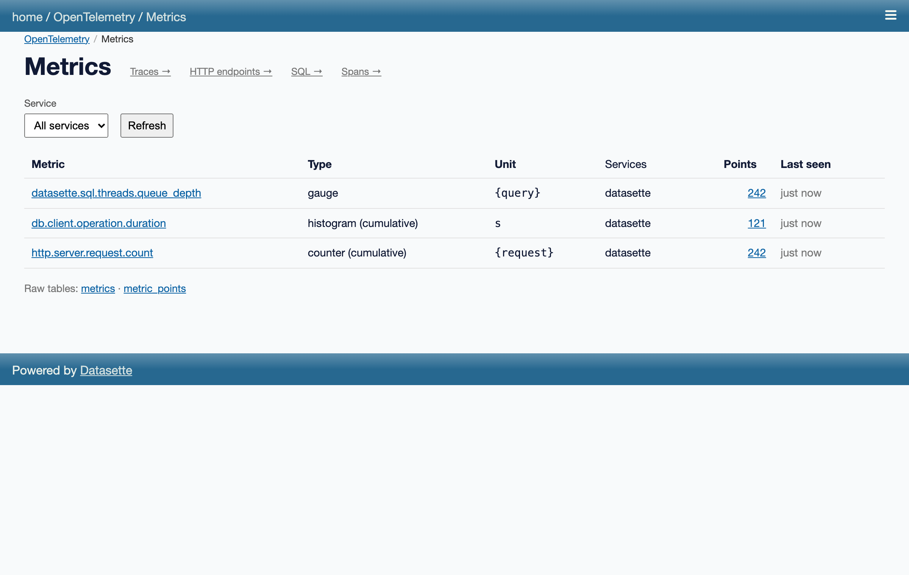
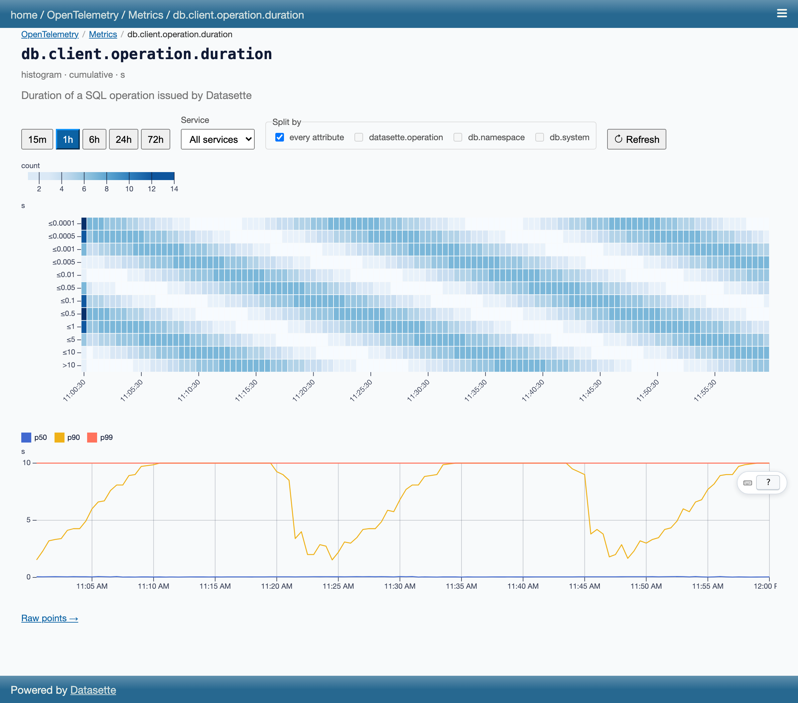

# datasette-otel-viewer

Browse the OpenTelemetry traces and metrics a Datasette instance emits, from
inside that instance. One plugin, two roles, one SQLite database:

- **Self-recording** (on by default): every span and metric point this
  Datasette emits is stored in a `traces`/`spans` + `metrics`/`metric_points`
  database served by the same instance.
- **Viewer**: `/-/otel` is the landing page (store counts, links);
  `/-/otel/traces` lists recent traces, each linking to a waterfall
  at `/-/otel/traces/<trace_id>`; `/-/otel/metrics` charts the stored metrics.
  The raw tables are regular Datasette tables — facets, JSON API and SQL come
  free.

Nothing else can write into the store over HTTP: this is a debugger for one
instance, not a backend for a fleet. Shipping spans off to a real backend is
the sibling exporter plugins' job (datasette-otel-otlp,
datasette-otel-parquet).

Successor to `datasette-otel-debugger`. Works against Datasette's OpenTelemetry
branches (phase 1); no released Datasette emits these spans yet.

## Privacy — read this first

**The span store contains `db.query.text`: on a public instance that is
user-supplied SQL, with literals.** It also holds URL paths and other request
attributes. Because of that the store and viewer are **private by default**:
reading them requires the `datasette-otel-viewer` permission (grant it via standard
Datasette permissions config, or use `--root`). `public_viewer: true` opens the
`/-/otel/traces` pages only — the raw tables stay gated. SQL parameter *values* are
never recorded by Datasette core, only parameter counts.

## Quickstart (self mode)

```bash
datasette install datasette-otel-viewer
datasette mydata.db --root
# browse a few pages, then open /-/otel/traces
```

No config needed: spans are stored in `otel.db` next to where you ran Datasette,
with a 72-hour / 100,000-span ring buffer.

## Metrics

This instance's own metrics are exported once a minute into the `metrics` and
`metric_points` tables, charted at `/-/otel/metrics` (see "Metrics pages"
below). Points are stored as exported, with their aggregation temporality
(`metrics.temporality`). A per-second rate for a cumulative counter, with counter resets treated as a
restart from zero, is one window function away — save it as a canned query:

```sql
with s as (
  select time_ns, service_name, attributes,
         coalesce(value_double, value_int) as v,
         lag(coalesce(value_double, value_int)) over w as prev_v,
         lag(time_ns) over w as prev_t
  from metric_points
  where metric_name = :metric
  window w as (partition by service_name, attributes order by time_ns)
)
select time_ns, service_name, attributes,
       case when v < prev_v then v else v - prev_v end
         / ((time_ns - prev_t) / 1e9) as per_second
from s where prev_t is not null
order by time_ns desc limit 100
```

## Config reference

```yaml
plugins:
  datasette-otel-viewer:
    self_traces: true          # false: browse an existing store without recording
    self_metrics: true         # false: don't store this instance's own metrics
    public_viewer: false       # true: /-/otel/traces without a permission grant
    retention_hours: 72        # ring buffer: whole traces older than this go
    max_spans: 100000          # ...and oldest whole traces beyond this count
    max_metric_points: 100000  # ...and the oldest metric points beyond this count
    db_name: otel
    db_path: otel.db
    service_name: datasette    # service.name for self-emitted spans and metrics
```

## How self-tracing avoids tracing itself

Storing a span means SQL writes through Datasette's instrumented write path —
which emits three more spans, which would be stored, which… (measured: ~10–14k
spans/s runaway, or deadlock, depending on configuration). This plugin ships the
one workaround that held up under measurement: it installs its own
`TracerProvider` whose sampler drops any span started under a private context
key, and attaches that key around every store write. Details and the failed
alternatives: `demos/otel/self_storage/README.md` in the Datasette repo.

Consequences:

- The plugin must own the `TracerProvider`. If another plugin (or the
  `opentelemetry-instrument` agent) installed one first, **self-tracing disables
  itself** with a stderr notice; the viewer still works. The sibling
  exporter plugins (datasette-otel-otlp, datasette-otel-parquet) attach to this
  plugin's provider, so install order matters only to them — and they handle it.
- Self mode relies on Datasette ≥ 1.0a39 running startup and serving on a single
  event loop; on older embedder lifecycles inserts are dropped with a warning
  rather than crashing.

Self metrics (`self_metrics`) do not need that ownership. There is no runaway
to cut — the store's own writes add one measurement to a series that already
exists, so a quiet instance exports the same handful of points every minute —
but points about the `otel` database describe the store rather than anything
the operator asked about, so they are dropped at export time.

Readers can join an SDK `MeterProvider` after it is built (`add_metric_reader`,
verified on opentelemetry-sdk 1.44), so unlike spans this plugin does not have
to win the provider race: if another plugin or the `opentelemetry-instrument`
agent installed one first, it attaches its reader to that provider and keeps
capturing, and only a provider that cannot take a reader makes self metrics
disable themselves with a stderr notice. `self_metrics: false` is the off
switch either way. In the other import order a sibling joins this plugin's
provider instead — `selfmetrics.add_metric_reader(reader)`, or
`add_metric_reader` on `opentelemetry.metrics.get_meter_provider()` — which is
what `datasette-otel-prometheus` needs to serve the same measurements in
Prometheus text format. Note that plugin's default path collides with this
viewer's `/-/otel/metrics` page; set its `path` option.

## Viewer


The pages are Svelte 5 + TypeScript, built with Vite and served through
[datasette-vite]. Both are backed by a JSON API with the same shapes:

- `POST /-/otel/api/traces/list` with `{"limit": 100, "service": "datasette"}`
- `GET /-/otel/api/traces/<trace_id>`

Gated exactly like the pages (`datasette-otel-viewer`, or `public_viewer: true`).

### Metrics pages





`/-/otel/metrics` lists every stored metric (type, unit, services, point
count, last seen); `/-/otel/metrics/<name>` charts one: multi-series lines
for gauges and sums with a per-second rate toggle for cumulative counters,
a bucket heatmap plus p50/p90/p99 for histograms, a time-range picker,
service filter and attribute split. Charts are [SveltePlot]. Both pages sit
on the same typed API:

- `POST /-/otel/api/metrics/list` with `{"service": "datasette"}`
- `POST /-/otel/api/metrics/query` with `{"name": "db.client.operation.duration",
  "since_ns": ..., "until_ns": ..., "step_s": 30, "group_by": ["db.namespace"],
  "percentiles": [0.5, 0.9, 0.99]}` — bucketed server-side, cumulative
  histograms differenced with counter-reset handling.

[SveltePlot]: https://svelteplot.dev/

## Development

```bash
uv sync && npm install --prefix frontend
just types          # Python → TypeScript (OpenAPI + page-data schemas)
just frontend       # build the bundle into the package
just test           # datasette from the otel branch via the uv source override
just dev            # self mode on :8012; pick Clark Kent in the debug bar, open /-/otel
just demo           # self mode on :8003 (viewer public; open /-/otel)
just shots          # regenerate docs/screenshots/*.png (used above)
```

Hot reload: `just frontend-dev` in one terminal and `just dev-with-hmr` in
another. `CLAUDE.md` has the code map and the type-generation pipelines.

[datasette-vite]: https://github.com/datasette/datasette-vite

